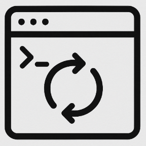

# EnvSwitch
Utility for quickly switching environment variables between multiple profiles (e.g. Dev, Stage, Prod)

Config example:

```yaml
{
  "Environments": [
    "Dev",
    "Stage",
    "Prod"
  ],
  "EnvironmentVariables": {
    "MyDatabaseConnectionString": {
      "Dev": "DevConnectionString",
      "Stage": "StageConnectionString",
      "Prod": "ProdConnectionString"
    },
    "MyApiEndpoint": {
      "Dev": "https://dev.example.com/api",
      "Stage": "https://stage.example.com/api"
    },
    "MyLogLevel": {
      "Dev": "Debug",
      "Stage": "Information",
      "Prod": "Error"
    }
  }
}
```

Filling the environment is optional. 
If a variable is not provided for a specific environment, its value will be deleted
